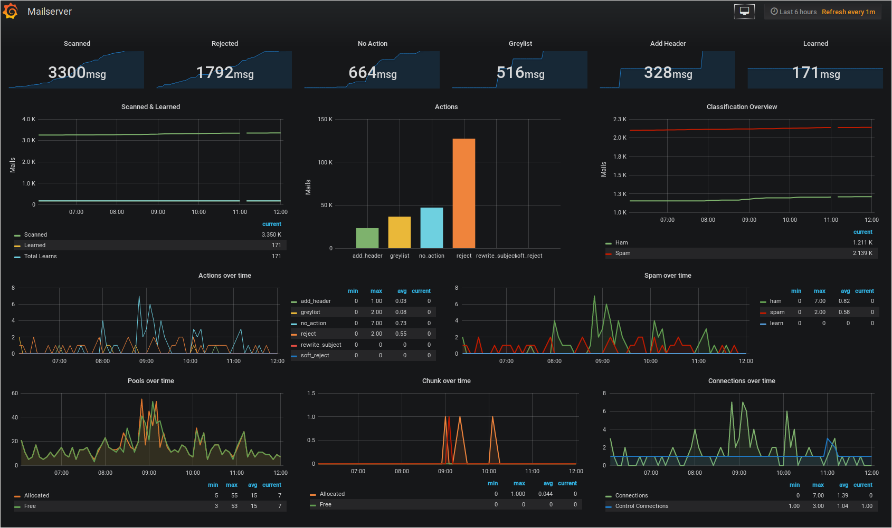

# rspamd-influxdb
Quick and dirty approach to get stats of rspamd out of the webinterface's API into InfluxDB for visualizing using Grafana.

## Usage
`python3 rspamd-influxdb.py --url "https://example.com:1337" --password "superSecretPassword"`

You may provide the URL and password by defining the path to a configuration file in order to prevent other users from reading the password in clear text from the process list. To do so you need to provide the `--config $path` argument, e.g.

`python3 rspamd-influxdb.py --config "~/config.json"`

The configuration file needs to contain the fields `url` and `password` as valid JSON. An example file could look like this:

```json
{
    "url": "https://example.com",
    "password": "superSecretPassword"
}
```

## Utilization
Use this script call within InfluxData's Telegraf

e.g.:
```toml
[[inputs.exec]]
	commands = ["python3 /opt/rspamd-influxdb/rspamd-influxdb.py --config /etc/telegraf/tools-conf/rspamd-fetch.json"]
	timeout = "5s"
	data_format = "influx"
```

**Security Tip**
```sh
chown root:telegraf /etc/telegraf/tools-conf/rspamd-fetch.json
chmod 640 /etc/telegraf/tools-conf/rspamd-fetch.json
```


## Grafana example

